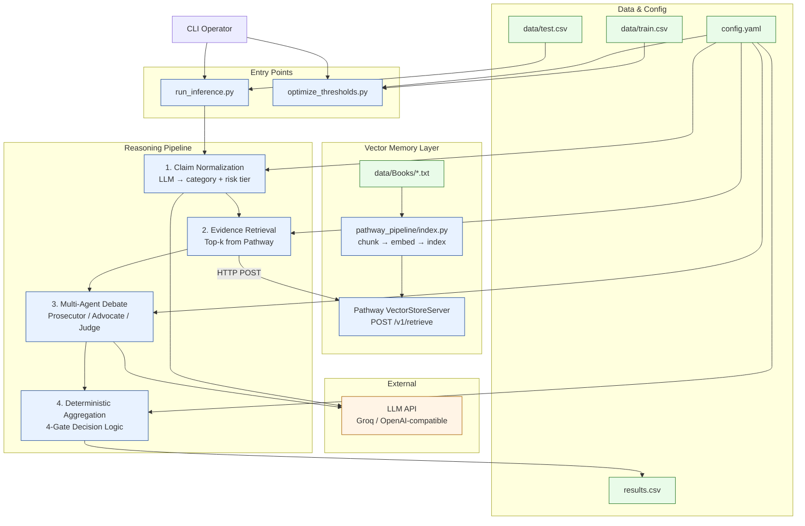
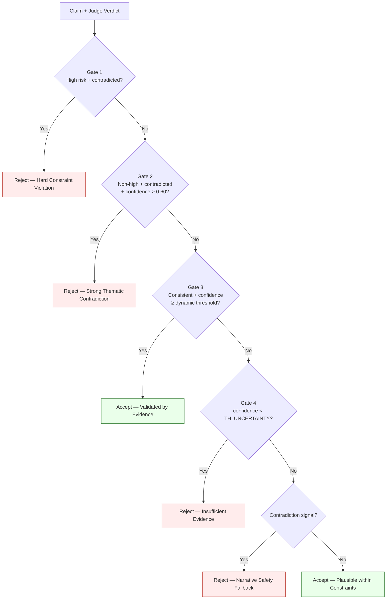

# Narrative Consistency Engine

> A constraint-aware, multi-agent reasoning system that makes high-stakes binary decisions about whether a proposed narrative claim is **consistent** or **contradictory** with source material — combining vector retrieval, adversarial LLM debate, and deterministic gate logic.

### Sample output  61 claims across 6 characters from 2 classic novels

| ID | Claim (excerpt) | Prediction | Rationale |
|----|----------------|-----------|-----------|
| 2 | *"Paganel learned Spanish on the voyage..."* | **0  Rejected** | Paganel learned Portuguese thinking it was Spanish |
| 124 | *"Faria was free in 1815..."* | **0  Rejected** | Faria was in solitary confinement in the Château d'If in 1815 |
| 97 | *"Noirtier built immunity to poison over years..."* | **1  Accepted** | Consistent with his survival and established canon |
| 59 | *"Thalcave survived by hunting and tracking..."* | **1  Accepted** | Fits Thalcave's documented skillset and survival capability |
| 85 | *"Kai-Koumou volunteered to help the captives..."* | **0  Rejected** | Kai-Koumou kidnapped them — no cooperation was established |

Every prediction ships with a one-sentence rationale grounded in retrieved evidence. Full output: [`results.csv`](results.csv).

---

## Quick start — runs in under 5 minutes

The repo includes a self-contained sample: a short synthetic narrative (`data/Books/The_Chronicles_of_Aldric.txt`) and 5 test claims (`data/test.csv`) with known expected outputs  so you can verify the system end-to-end without sourcing any external data.

```bash
# Terminal A — start vector memory server
python pathway_pipeline/index.py

# Terminal B — run inference against sample data
python run_inference.py
# → results.csv  (id, prediction, rationale for each claim)
```

Expected output for the included sample:

| id | Expected | Claim |
|----|---------|-------|
| 1 | 1 | Aldric avoided relationships due to grief (Psychological) |
| 2 | 0 | Aldric was in Meros by 1055 — ten years too early (Temporal) |
| 3 | 1 | Aldric returned to Meros after release in 1068 (Physical/Existence) |
| 4 | 0 | Aldric died in the Fortress — contradicts his documented release (Existence) |
| 5 | 1 | Aldric befriended a learned man in prison (Relational) |

---

## Why this exists

Standard RAG is built for similarity, not consistency. Retrieving the most relevant passage from a book does not tell you whether a proposed backstory *contradicts* the canon. This project attacks that gap directly.

The core insight: narrative verification is closer to legal reasoning than document search. A claim must survive adversarial challenge, be grounded in retrieved evidence, and pass deterministic acceptance criteria  not just score high on cosine similarity.

**Primary application**: Lore validation pipelines for games, fiction platforms, and fan communities  where the cost of accepting a contradictory claim is high and explainability matters.

---

## System Architecture

The system is a five-stage sequential pipeline, config-driven throughout.

```
Input CSV
    │
    ▼
┌─────────────────────────────────┐
│  1. Claim Normalization          │  LLM classifies claim → category + risk tier
│     reasoning/normalization.py   │
└────────────────┬────────────────┘
                 │
                 ▼
┌─────────────────────────────────┐
│  2. Evidence Retrieval           │  Top-k chunks from Pathway vector server
│     retrieval/retrieve.py        │  (POST /v1/retrieve)
└────────────────┬────────────────┘
                 │
                 ▼
┌─────────────────────────────────┐
│  3. Multi-Agent Debate           │  Prosecutor → Advocate → Judge
│     reasoning/debate.py          │  Returns: {status, confidence, key_point}
└────────────────┬────────────────┘
                 │
                 ▼
┌─────────────────────────────────┐
│  4. Deterministic Aggregation    │  4-gate logic with risk-adjusted thresholds
│     reasoning/aggregation.py     │  → binary prediction (0 or 1) + rationale
└────────────────┬────────────────┘
                 │
                 ▼
           results.csv
```

### Component Map



---

## Stage 1 — Risk Taxonomy (RIX Classification)

Before any retrieval or reasoning occurs, every claim is classified into a **risk tier** by a dedicated LLM taxonomist prompt. This tier governs how strictly the system judges the claim through all downstream stages.

### The Three-Tier Taxonomy

| Tier | Categories | Behavior |
|------|-----------|----------|
| **High** | Temporal · Physical · Existence · Identity | Zero tolerance for contradiction. Gate 1 hard-rejects any High-risk claim the Judge marks as contradicted. Acceptance threshold raised by +0.10. |
| **Medium** | Ideological · Relational · Political | Strong contradiction with confidence > 0.60 triggers rejection. Standard thresholds apply. |
| **Low** | Psychological · Cultural · Symbolic | Acceptance threshold relaxed by −0.10. Subjective claims require less confidence to pass. |

**Why this matters**: Not all narrative errors are equal. A claim that a character was *alive after their confirmed death* (Existence/High) is categorically different from a claim about their *personality* (Psychological/Low). Treating them identically either over-rejects subjective claims or under-rejects hard factual violations.

### Classification Prompt Design

The normalization LLM receives the book name, character name, and claim text. It returns a structured JSON response:

```json
{
  "category": "Temporal",
  "reasoning": "The claim specifies an event sequence that conflicts with the book's timeline."
}
```

The `category` field is mapped to a risk tier via the config-driven taxonomy:

```yaml
taxonomy:
  high_risk:  [Temporal, Physical, Existence, Identity]
  medium_risk: [Ideological, Relational, Political]
  low_risk:   [Psychological, Cultural, Symbolic]
```

---

## Stage 3 — Multi-Agent Debate (Judiciary Pattern)

The debate stage is the semantic core of the system. Three specialized agents process the same claim and evidence, each with an adversarial role  modeled after a legal proceeding.

```
Evidence chunks (deduplicated)
         │
         ├──→  PROSECUTOR  →  attacks the claim, finds contradictions
         │
         ├──→  ADVOCATE    →  defends the claim, finds supporting evidence
         │
         └──→  JUDGE       ←  reads both arguments, returns structured verdict
                              { status, confidence, key_point }
```

**Why adversarial**: A single LLM pass tends to be confirmation-biased , it anchors on the most salient retrieved text. Forcing explicit prosecution before defense surfaces contradictions that a single-pass model glosses over.

**Conservative fallback**: If the Judge's response cannot be parsed as valid JSON, the system falls back to `{ "status": "Uncertain", "confidence": 0.0 }`, which propagates through Gate 4 as a rejection. Uncertain claims are not accepted.

### Judge Verdict Schema

```json
{
  "status": "Consistent | Contradicted | Uncertain",
  "confidence": 0.0,
  "key_point": "One-sentence summary of the deciding factor"
}
```

---

## Stage 4 — Deterministic 4-Gate Aggregation

The aggregation layer converts probabilistic LLM output into a **deterministic binary decision**. It is the only stage with no LLM calls , it is pure logic, driven by the risk tier and two tunable thresholds.

### Gate Logic

```
Input: {status, confidence, risk_tier}

GATE 1 — Hard Constraint (High Risk)
  IF risk == "High" AND status contains "contradict"
  → REJECT (0)  "Hard Constraint Violation"

GATE 2 — Strong Soft Contradiction
  IF risk != "High" AND status contains "contradict" AND confidence > 0.60
  → REJECT (0)  "Strong Thematic Contradiction"

GATE 3 — Evidence Accumulation (Acceptance Gate)
  IF status contains "consistent":
    required_confidence = TH_CONSISTENCY        (base, e.g. 0.55)
                        + 0.10 if risk == High  (→ 0.65)
                        - 0.10 if risk == Low   (→ 0.45)
    IF confidence >= required_confidence
    → ACCEPT (1)  "Validated by Evidence"

GATE 4 — Uncertainty Resolution
  IF confidence < TH_UNCERTAINTY
  → REJECT (0)  "Insufficient Evidence (Conservative Bias)"

  IF status contains "contradict"
  → REJECT (0)  "Contradicted by Evidence"

  → ACCEPT (1)  "Plausible within constraints"
```

### Decision Flowchart



**Key design principle**: The system has a conservative bias . when evidence is ambiguous or missing, it rejects rather than accepts. Accepting a contradictory claim damages narrative integrity in ways that are difficult to reverse; rejection is always auditable and explainable.

---

## Threshold Optimization via Grid Search

The two aggregation thresholds (`TH_CONSISTENCY`, `TH_UNCERTAINTY`) directly control accuracy. Rather than hand-tuning, they are calibrated against labeled training data using an exhaustive grid search.

### Why Grid Search Here

The aggregation function is non-differentiable  it is a sequence of conditional branches, not a smooth loss surface. Gradient-based optimization is not applicable. Grid search over a bounded 2D parameter space is the correct approach.

### Search Space

| Parameter | Range | Step | Values explored |
|-----------|-------|------|----------------|
| `TH_CONSISTENCY` | 0.40 → 0.90 | 0.05 | 11 values |
| `TH_UNCERTAINTY` | 0.10 → 0.60 | 0.05 | 11 values |
| **Total combinations** | | | **121** |

### Two-Phase Optimization Strategy

**Phase 1 — LLM Precomputation** (expensive, runs once):  
For each training sample, run the full pipeline through the Judge stage. Cache `{status, confidence, risk_tier}` for every sample. This is the only LLM-dependent phase.

**Phase 2 — Grid Sweep** (cheap, runs 121× per sample):  
Replay the aggregation logic mathematically against the cached signals  no LLM calls. Each of the 121 threshold combinations scores the entire training set in milliseconds.

```python
for th_c in np.arange(0.40, 0.95, 0.05):     # consistency thresholds
    for th_u in np.arange(0.10, 0.65, 0.05): # uncertainty thresholds
        preds = [simulate_aggregation(row, th_c, th_u) for row in cached_data]
        acc   = accuracy_score(targets, preds)
        if acc > best_acc:
            best_acc, best_params = acc, (th_c, th_u)
```

**Result**: Best-performing `(TH_CONSISTENCY, TH_UNCERTAINTY)` pair is written back to `config.yaml` automatically.

### Decoupled Architecture Benefit

This separation  LLM reasoning once, grid search over cached signals — means threshold optimization costs one LLM pass over training data, not 121. It scales cleanly to larger training sets and supports repeated re-optimization as the LLM provider changes.

---

## Vector Memory Layer (Pathway)

Books are ingested, chunked with overlap, embedded using `all-MiniLM-L6-v2` (384-dimensional dense vectors), and served via a Pathway `VectorStoreServer` over HTTP.

Retrieval queries are book-scoped: the query is prefixed with `"BookName: <claim text>"` to bias retrieval toward the relevant source. This reduces cross-book evidence noise in multi-book deployments.

Evidence chunks are deduplicated before being passed to the debate stage to reduce prompt redundancy and token cost.

---

## Failure Handling

| Failure point | Behavior |
|--------------|----------|
| Retrieval server unreachable | Evidence set → empty; pipeline continues with conservative bias |
| Judge returns invalid JSON | Verdict → `{status: "Uncertain", confidence: 0.0}`; Gate 4 rejects |
| Normalization LLM fails | Claim category → `"Symbolic"`, risk tier → `"Low"` (least strict path) |
| `test.csv` not found | Script checks multiple candidate paths; exits with clear error |
| Missing `config.yaml` | All modules carry hard-coded safe defaults |

The system never crashes silently. Every failure path degrades to a deterministic, conservative output.

---

## Tech Stack

| Layer | Technology |
|-------|-----------|
| Language | Python 3.10+ |
| Vector store | Pathway `VectorStoreServer` |
| Embeddings | `sentence-transformers/all-MiniLM-L6-v2` |
| LLM client | OpenAI-compatible SDK (Groq default) |
| Data utilities | pandas, numpy, pyyaml, tqdm |
| Optimization | scikit-learn (`accuracy_score`, `train_test_split`) |

---

## Setup

```bash
# 1. Clone
git clone <repo-url>
cd Narrative-Consistency-Engine

# 2. Virtual environment
python -m venv .venv
source .venv/bin/activate   # Windows: .venv\Scripts\activate

# 3. Dependencies
pip install -r requirements.txt

# 4. Config
cp config.yaml.example config.yaml
# Edit config.yaml: set llm.api_key and verify pathway host/port
```

**Minimal `config.yaml`**:

```yaml
pathway:
  host: "0.0.0.0"
  port: 8000
  data_dir: "./data/Books"

aggregation:
  consistency_threshold: 0.55
  uncertainty_threshold: 0.30

llm:
  provider: "groq"
  model: "llama-3.1-8b-instant"
  api_key: "YOUR_API_KEY"

taxonomy:
  high_risk:   [Temporal, Physical, Existence, Identity]
  medium_risk:  [Ideological, Relational, Political]
  low_risk:    [Psychological, Cultural, Symbolic]
```

---

## Running the Pipeline

**Terminal A — Start vector memory server:**

```bash
python pathway_pipeline/index.py
```

**Terminal B — Optional: calibrate thresholds against training data:**

```bash
python optimize_thresholds.py
```

**Terminal B — Run inference:**

```bash
python run_inference.py
```

Output: `results.csv` with columns `id`, `prediction` (0/1), `rationale`.

---

## Project Structure

```
.
├── run_inference.py          # Main pipeline orchestrator
├── optimize_thresholds.py    # Grid search threshold calibration
├── config.yaml.example
├── results.csv               # Sample output — 61 claims with rationale
├── reasoning/
│   ├── claims.py             # NarrativeClaim data model
│   ├── normalization.py      # LLM-based risk tier classification
│   ├── debate.py             # Prosecutor / Advocate / Judge agents
│   └── aggregation.py        # 4-gate deterministic decision logic
├── retrieval/
│   └── retrieve.py           # Pathway HTTP retrieval client
├── pathway_pipeline/
│   ├── index.py              # Vector server startup
│   └── ingest.py             # Book chunking + embedding
├── llm/
│   ├── wrapper.py            # LLM client abstraction
│   └── embedder.py           # Lazy-loading embedding singleton
└── data/
    ├── Books/
    │   └── The_Chronicles_of_Aldric.txt   # Sample narrative (synthetic, runnable)
    ├── train.csv             # Labeled claims for threshold optimization
    └── test.csv              # 5-row sample — works out of the box
```

---

## Extending the System

**Swap the LLM provider**: Update `llm.provider` and `llm.model` in `config.yaml`. The `llm/wrapper.py` abstraction requires no code changes for any OpenAI-compatible endpoint.

**Add a new risk category**: Add the category name to the appropriate tier in `config.yaml` under `taxonomy`. The normalization prompt and aggregation logic pick it up automatically.

**Re-calibrate thresholds**: Run `optimize_thresholds.py` after any change to the LLM model, prompt, or training data. The grid search takes one LLM pass over training data.

**Scale inference**: The per-claim pipeline is stateless. Parallelization is a wrapper around `run_inference.py`'s main loop — no architectural changes needed.

---

## Design Rationale

**Why multi-agent debate over a single prompt?**  
Single-pass LLMs anchor on the first relevant passage and rarely stress-test the opposite interpretation. Forcing an explicit prosecution argument surfaces contradictions that a single-pass model misses or downweights.

**Why deterministic gates after the LLM stage?**  
LLM confidence scores are not calibrated probabilities. Treating them as such produces unstable predictions across runs. The gate layer converts soft signals into hard, auditable decisions — making behavior predictable and tunable without retraining.

**Why a risk taxonomy?**  
Temporal and existence errors are categorically more damaging to narrative integrity than subjective psychological claims. Uniform thresholds either over-reject soft claims or under-reject hard factual violations. The three-tier taxonomy lets each category be judged on its own standard.

**Why conservative bias?**  
In canon validation, a false acceptance (letting a contradictory claim through) is more damaging than a false rejection (blocking a consistent claim). The system defaults to rejection under uncertainty. Accepted claims carry explicit evidence citations; rejections carry explicit contradiction rationale.

---

## Contributing

Contributions are welcome — bug fixes, new risk categories, improved prompts, or alternative LLM backends.

### What makes a good contribution here

This project is built around three invariants that any change should preserve:

1. **Conservative bias** — when in doubt, reject. Don't loosen gates without evidence from the training set.
2. **Determinism after the LLM stage** — the aggregation layer must stay free of stochastic calls. Keep LLM calls upstream of `aggregation.py`.
3. **Config-driven behavior** — thresholds, taxonomy, and provider settings live in `config.yaml`, not hardcoded in logic.

### Getting started

```bash
git clone https://github.com/Roshansingh9/Narrative-Consistency-Engine.git
cd Narrative-Consistency-Engine
git checkout -b feature/your-change
```

Run the sample end-to-end before and after your change to confirm nothing regressed:

```bash
python pathway_pipeline/index.py   # Terminal A
python run_inference.py            # Terminal B — check results.csv
```

### Branch naming

| Type | Pattern |
|------|---------|
| New feature | `feature/<short-description>` |
| Bug fix | `fix/<short-description>` |
| Prompt / taxonomy tuning | `tune/<what-changed>` |
| Docs | `docs/<short-description>` |

### Pull request checklist

- [ ] Describe *what* changed and *why* (not just how)
- [ ] Include before/after output rows from `results.csv` if the change affects predictions
- [ ] If you modified thresholds, run `optimize_thresholds.py` and report the accuracy delta
- [ ] Confirm `run_inference.py` completes without errors on the sample data

### Areas where contributions are most useful

- **Prompt hardening** — the normalization and judge prompts are the most fragile part of the pipeline. Better JSON extraction, structured output enforcement, or few-shot examples would directly improve reliability.
- **Async inference** — the main loop in `run_inference.py` is synchronous. A batched/async version with rate-limit handling would significantly cut wall-clock time.
- **Evaluation metrics** — the optimizer currently tracks accuracy only. Precision/recall split by risk tier would give a much clearer picture of where the system fails.
- **New LLM backends** — `llm/wrapper.py` wraps an OpenAI-compatible client. Adding native support for Anthropic, Mistral, or local Ollama endpoints would broaden deployment options.

---

## License

This project is licensed under the **MIT License**.

```
MIT License

Copyright (c) 2026 Roshan Kr Singh

Permission is hereby granted, free of charge, to any person obtaining a copy
of this software and associated documentation files (the "Software"), to deal
in the Software without restriction, including without limitation the rights
to use, copy, modify, merge, publish, distribute, sublicense, and/or sell
copies of the Software, and to permit persons to whom the Software is
furnished to do so, subject to the following conditions:

The above copyright notice and this permission notice shall be included in all
copies or substantial portions of the Software.

THE SOFTWARE IS PROVIDED "AS IS", WITHOUT WARRANTY OF ANY KIND, EXPRESS OR
IMPLIED, INCLUDING BUT NOT LIMITED TO THE WARRANTIES OF MERCHANTABILITY,
FITNESS FOR A PARTICULAR PURPOSE AND NONINFRINGEMENT. IN NO EVENT SHALL THE
AUTHORS OR COPYRIGHT HOLDERS BE LIABLE FOR ANY CLAIM, DAMAGES OR OTHER
LIABILITY, WHETHER IN AN ACTION OF CONTRACT, TORT OR OTHERWISE, ARISING FROM,
OUT OF OR IN CONNECTION WITH THE SOFTWARE OR THE USE OR OTHER DEALINGS IN THE
SOFTWARE.
```

---

## Acknowledgments

- [Pathway](https://pathway.com) — vector store and real-time data processing infrastructure
- [SentenceTransformers](https://www.sbert.net) — `all-MiniLM-L6-v2` embedding model
- [Groq](https://groq.com) — LLM inference API used in development
