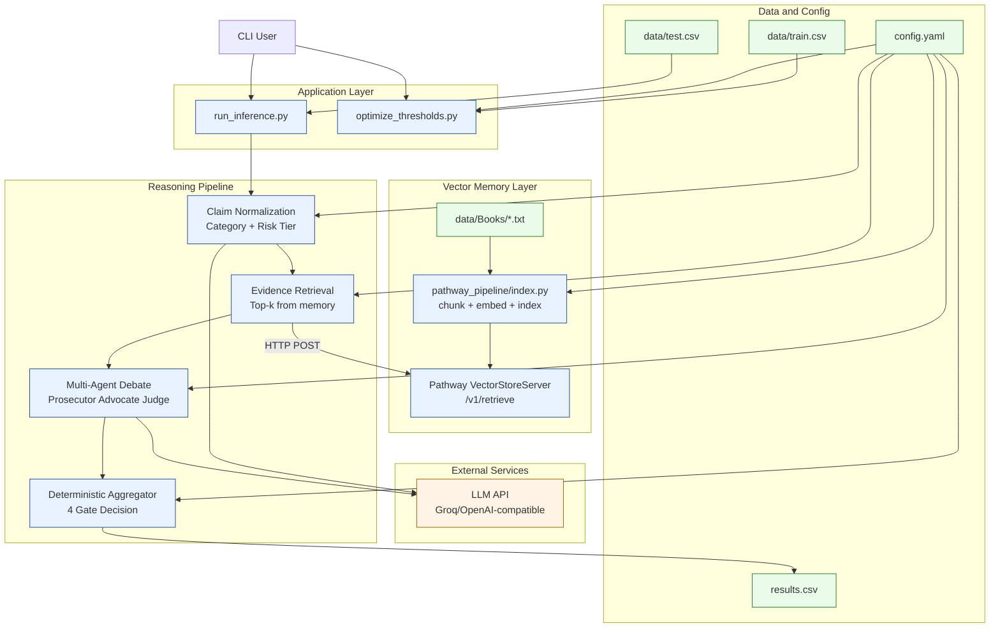
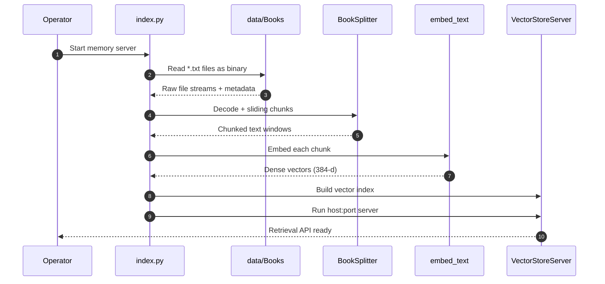
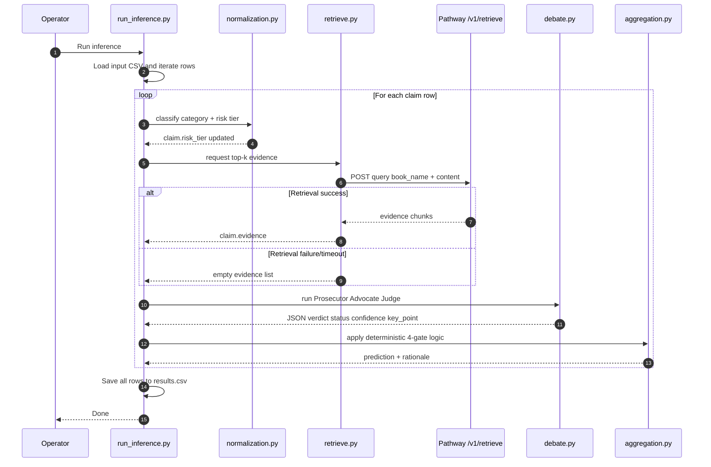
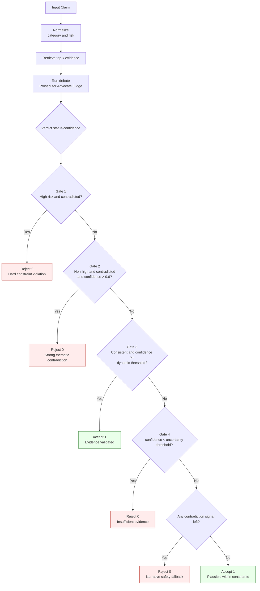
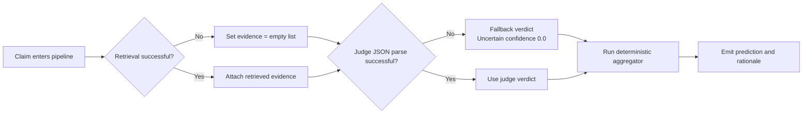

# Narrative Consistency Engine for Character Backstories

Constraint-based, multi-agent reasoning system for deciding whether a proposed character backstory is **consistent (1)** or **contradictory (0)** with source narrative books.

Built for Kharagpur Data Science Hackathon 2026 (Track A).

---

## 1. Project Overview

### What this project does
This project reads candidate backstory claims and evaluates whether they fit the canon narrative. It combines:

- Vector retrieval over book text
- LLM-based claim classification and debate
- Deterministic rule gates for final binary decision

### Problem it solves
Pure LLM responses can be persuasive but inconsistent. This system reduces hallucination risk by forcing each decision through explicit evidence + rules.

### Target users

- Hackathon teams building narrative consistency checkers
- NLP/LLM engineers experimenting with hybrid symbolic + LLM reasoning
- Product teams building lore validation tools for games, fiction platforms, and fan communities

### Real-world use case
A game studio receives community-submitted character lore updates. Before approval, each submission is checked against source books. Contradictory claims are rejected with rationale; consistent claims pass.

---

## 2. Key Features

- ✅ End-to-end claim verification pipeline (`run_inference.py`)
- ✅ Risk-aware claim normalization into taxonomy tiers (High/Medium/Low)
- ✅ Retrieval-augmented reasoning via Pathway vector server
- ✅ Three-agent debate pattern:
	- Prosecutor (attacks claim)
	- Advocate (defends claim)
	- Judge (returns JSON verdict + confidence)
- ✅ Deterministic 4-gate aggregation layer for final prediction
- ✅ Conservative safety bias under uncertainty
- ✅ Threshold optimization script (`optimize_thresholds.py`) using grid search
- ✅ Config-driven behavior (`config.yaml`)
- ✅ Fallback/default handling for missing config in some modules
- ✅ CSV-based batch inference output (`results.csv`) with rationale per claim

Advanced/hidden behavior:

- Lazy loading of embedding model for efficiency (`llm/embedder.py`)
- Evidence deduplication before LLM debate (`reasoning/debate.py`)
- Dynamic threshold adjustment by risk tier in aggregation

---

## 3. System Architecture

### High-level explanation
The system has a CLI-driven workflow (acts as the "frontend"), an orchestration backend, a vector-memory service, LLM providers, and local data/config files.

1. Books are ingested and indexed by Pathway.
2. Inference script loads claims from CSV.
3. Each claim is normalized, evidence is retrieved, and agents debate.
4. Aggregation gates convert probabilistic debate output into deterministic binary labels.

### Architecture Diagram (Mermaid)



---

## 4. Core Workflows

### Workflow A: Build narrative memory index

Step-by-step:

1. Load `config.yaml` for host, port, and books directory.
2. Read raw `.txt` files from `data/Books`.
3. Split text into overlapping chunks.
4. Embed chunks using MiniLM.
5. Start Pathway retrieval server.



### Workflow B: Inference on test claims

Step-by-step:

1. Read `data/test.csv` (with fallback paths).
2. Create `NarrativeClaim` object.
3. Classify claim and assign risk tier.
4. Retrieve top-k evidence from Pathway.
5. Run Prosecutor/Advocate/Judge debate.
6. Apply deterministic gates.
7. Save prediction + rationale to `results.csv`.



### Workflow C: Threshold optimization

Step-by-step:

1. Load training CSV and map labels to binary targets.
2. Split dataset for optimization subset.
3. Precompute expensive LLM outputs once.
4. Grid search consistency/uncertainty thresholds.
5. Persist best thresholds into `config.yaml`.

```mermaid
sequenceDiagram
	autonumber
	participant Dev as Operator
	participant Opt as optimize_thresholds.py
	participant Pipe as Norm+Retrieve+Debate
	participant Grid as GridSearch
	participant CFG as config.yaml

	Dev->>Opt: Run optimizer
	Opt->>Opt: Load train.csv and map labels
	Opt->>Opt: Split optimization subset

	loop For each training sample
		Opt->>Pipe: Generate risk + verdict signals
		Pipe-->>Opt: status confidence risk
	end

	Opt->>Grid: Sweep consistency and uncertainty thresholds
	Grid-->>Opt: best parameter pair
	Opt->>CFG: Persist optimized thresholds
	Opt-->>Dev: Print best accuracy and values
```

---

## 5. Data Flow & Logic

### Data movement

- Input data sources:
	- `data/Books/*.txt` for memory index
	- `data/train.csv` for optimization
	- `data/test.csv` for inference
- Intermediate artifacts:
	- In-memory evidence lists
	- Judge verdict JSON (`status`, `confidence`, `key_point`)
- Output artifacts:
	- `results.csv` with `id`, `prediction`, `rationale`

### Decision logic flowchart



### Failure-handling flowchart



### Edge cases and failure handling

- Missing input CSV in inference:
	- Script checks multiple candidate paths.
	- If none found, exits with an error message.
- Retrieval server unavailable or timeout:
	- Retrieval exceptions are caught.
	- Evidence becomes empty list; pipeline continues.
- LLM output not valid JSON:
	- Debate layer catches parsing issues.
	- Falls back to `Uncertain` with low confidence.
- Missing/invalid taxonomy config:
	- Normalization module uses default taxonomy.
- Empty claim text:
	- Retrieval is skipped for that claim.

---

## 6. Design Decisions

### Why these choices were made

1. Multi-agent debate instead of single prompt:
	 - Encourages adversarial reasoning before verdict.
2. Deterministic aggregation after LLM stage:
	 - Makes final behavior predictable and tunable.
3. Risk-tiered constraints:
	 - Temporal/existence errors are treated more strictly than subjective claims.
4. Vector retrieval before reasoning:
	 - Grounds arguments in narrative evidence.

### Alternatives considered (brief comparison)

| Approach | Pros | Cons | Why not default |
|---|---|---|---|
| Single LLM yes/no | Simple, fast to prototype | Unstable, hard to audit | Not deterministic enough |
| Pure rule engine (no LLM) | Fully deterministic | Weak on nuanced language | Misses semantic flexibility |
| This hybrid (chosen) | Grounded + explainable + tunable | More components to operate | Best balance for hackathon goals |

### Venn-style explanation (described)

Think of this system as the overlap of three circles:

- Circle A: Retrieval grounding (evidence from books)
- Circle B: LLM semantic reasoning (Prosecutor/Advocate/Judge)
- Circle C: Deterministic safety logic (4-gate aggregation)

The final prediction is only trusted in the center overlap where all three agree.

---

## 7. Tech Stack

### Core runtime

- Python 3.10+ (main language)
- pandas, numpy, pyyaml, tqdm (data + config utilities)

### Retrieval and indexing

- Pathway (real-time data processing and vector store server)
- sentence-transformers (`all-MiniLM-L6-v2`) for embeddings
- torch (embedding model runtime)

### LLM integration

- openai Python SDK (OpenAI-compatible client)
- Groq API endpoint (default in current setup)
- requests (HTTP retrieval calls)

### Optimization and evaluation

- scikit-learn (`train_test_split`, `accuracy_score`)

---

## 8. Installation & Setup

### Prerequisites

- Python 3.10 or newer
- pip
- Network access to your configured LLM provider (Groq/OpenAI-compatible)
- Book text files in `data/Books`
- Dataset CSV files (`data/train.csv`, `data/test.csv`)

### Step-by-step setup

```bash
# 1) Clone and enter project
git clone <your-repo-url>
cd LoneWizard_KDSH_2026

# 2) Create virtual environment (recommended)
python -m venv .venv
source .venv/bin/activate

# 3) Install dependencies
pip install -r requirements.txt

# 4) Create runtime config
cp config.yaml.example config.yaml
```

Edit `config.yaml` with your API key and desired settings.

### Environment variables (`.env` example)

The code supports using `OPENAI_API_KEY` as an override in `llm/wrapper.py`.

```env
# Optional override for LLM key (instead of storing only in config.yaml)
OPENAI_API_KEY=your_provider_api_key_here
```

If you use `.env`, load it before running scripts (for example via your shell or dotenv tooling).

### Minimal `config.yaml` example

```yaml
pathway:
	host: "0.0.0.0"
	port: 8000
	data_dir: "./data/Books"
	csv_path: "./data/train.csv"

aggregation:
	consistency_threshold: 0.55
	uncertainty_threshold: 0.30

llm:
	provider: "groq"
	model: "llama-3.1-8b-instant"
	api_key: "YOUR_API_KEY"
```

### Common setup errors and fixes

1. `config.yaml not found`
	 - Fix: `cp config.yaml.example config.yaml`

2. Retrieval connection errors (`/v1/retrieve` failed)
	 - Fix: Start memory server first with `python pathway_pipeline/index.py`
	 - Verify `host`/`port` in `config.yaml`

3. `test.csv not found`
	 - Fix: Place file at `data/test.csv` (preferred) or root fallback path

4. Invalid API key / LLM failure
	 - Fix: Update key in `config.yaml` and/or `OPENAI_API_KEY`

---

## 9. API Documentation

This project is primarily CLI-based. The direct HTTP API used internally is Pathway retrieval.

### Retrieval endpoint

- Method: `POST`
- URL: `http://<pathway_host>:<pathway_port>/v1/retrieve`
- Used by: `retrieval/retrieve.py`

Request example:

```json
{
	"query": "BookName: Claim text goes here",
	"k": 5
}
```

Typical response shape (example):

```json
[
	{
		"text": "Relevant narrative chunk...",
		"metadata": {
			"book_name": "Book_Title",
			"path": "./data/Books/Book_Title.txt"
		}
	}
]
```

Error handling behavior:

- Timeout/network errors are caught and logged.
- Retrieval returns empty evidence list; pipeline continues with conservative behavior.

### CLI contract (batch inference)

- Input: CSV with columns expected by `run_inference.py` (`id`, `content`, `book_name`, `char`)
- Output: `results.csv` with columns `id`, `prediction`, `rationale`

---

## 10. Folder Structure

```text
.
├── config.yaml.example
├── optimize_thresholds.py
├── README.md
├── requirements.txt
├── results.csv
├── run_inference.py
├── llm/
│   ├── __init__.py
│   ├── client.py
│   ├── embedder.py
│   └── wrapper.py
├── pathway_pipeline/
│   ├── __init__.py
│   ├── index.py
│   └── ingest.py
├── reasoning/
│   ├── __init__.py
│   ├── agents.py
│   ├── aggregation.py
│   ├── claims.py
│   ├── debate.py
│   └── normalization.py
├── retrieval/
│   ├── __init__.py
│   └── retrieve.py
└── scoring/
		├── __init__.py
		└── scorer.py
```

What each important part does:

- `run_inference.py`: Main end-to-end inference orchestrator
- `optimize_thresholds.py`: Grid-search calibration for aggregation thresholds
- `pathway_pipeline/`: Book ingestion + vector server startup
- `retrieval/`: HTTP retrieval client against Pathway server
- `reasoning/`: Claim model, normalization, debate, deterministic aggregation
- `llm/`: LLM wrapper/client and embedding UDF

Note: `reasoning/agents.py` and `scoring/scorer.py` include patterns/components not used by the main inference script in its current flow.

---

## 11. Usage Guide

### Quick start

1. Start vector memory server in terminal A:

```bash
python pathway_pipeline/index.py
```

2. Run inference in terminal B:

```bash
python run_inference.py
```

3. Check output file:

- `results.csv`

### Optional: optimize thresholds before inference

```bash
python optimize_thresholds.py
python run_inference.py
```

### Example scenarios

- Scenario 1: Strict canon checking for timeline claims
	- High-risk temporal contradiction should usually resolve to prediction `0`.
- Scenario 2: Ambiguous psychological claim
	- Low-risk, moderate-confidence claims may pass via dynamic thresholding.
- Scenario 3: Missing evidence in memory index
	- Pipeline still returns result, but conservative gates often reject unsupported claims.

---

## 12. Performance & Scalability

### Optimizations already present

- Embedding model lazy-load singleton (`llm/embedder.py`)
- Debate evidence deduplication to reduce prompt noise
- One-time LLM precomputation during threshold optimization

### Bottlenecks

- LLM calls dominate latency (normalization + 3-agent debate)
- Retrieval depends on server/network health
- Current inference loop is row-by-row synchronous

### Scalability strategies

- Add async/batched LLM calls with rate-limit handling
- Cache normalization/debate outputs for repeated claims
- Run multiple inference workers with queue-based orchestration
- Externalize retrieval and reasoning as service endpoints for horizontal scaling

---

## 13. Future Improvements

Planned enhancements:

- Better JSON parsing and schema validation for LLM outputs
- Unified config management with environment-variable-first strategy
- Stronger evaluation metrics beyond accuracy (F1, precision/recall by risk tier)
- Native experiment tracking for threshold sweeps
- Optional explainability reports with cited evidence spans

Known limitations:

- Depends on external LLM API quality and availability
- Pathway server must be running for retrieval to work
- Some modules appear legacy/experimental and are not in the main path

---

## 14. Contribution Guide

### How to contribute

1. Fork the repository
2. Create a branch from `main`
3. Make focused, testable changes
4. Open a PR with clear problem statement and sample output

### Recommended branch naming

- `feature/<short-description>`
- `fix/<short-description>`
- `docs/<short-description>`

### Code style and quality expectations

- Follow existing Python style and naming patterns
- Keep functions small and composable
- Add docstrings for non-trivial logic
- Prefer config-driven changes over hard-coded constants

### PR checklist

- [ ] Explain what changed and why
- [ ] Include before/after behavior
- [ ] Mention config changes (if any)
- [ ] Confirm scripts still run (`run_inference.py`, optionally `optimize_thresholds.py`)

---

## Acknowledgments

- Pathway for vector retrieval infrastructure
- SentenceTransformers for embedding models
- OpenAI-compatible APIs (Groq/OpenAI) for reasoning stage
